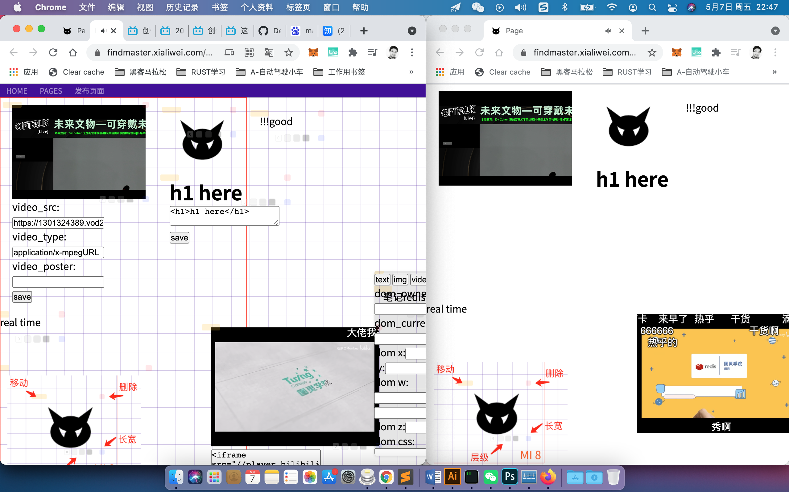

1、项目名称：个人互动主页生成器

2、团队介绍：夏力维，来自上海，全栈工程师，辍学创业多年已跪，自己缴社保中，平时接私活，准爸爸。

3、项目介绍

    (1) 作品简介：个人互动主页生成器，是使用websocket搭建的聊天室，通过预设dom层结构化类型，进行实时拖动与编辑。可以像做PPT一样做网页设计，并且可持久化呈现。拥有私有化、发布、公开三种不同权限状态。可邀请小伙伴一块进行编辑、修改与建议。适用于外包接活、个人笔记、会议纪要、项目信息整理、文档发布、邀请函制作、升级个人直播间等装扮。

    (2) 作品优势：解放dom层，交给了用户。用户可从模板市场选择成型代码块，丰富直播间。也可以邀请技术小伙伴一同维护同一个主页空间。改变了博客生成富文本编辑器的局限。让开放的更开放，让专注的更专注。使用了H5特性contenteditable和contentDocument进行内容生成验证，保证了一定容错性。

    (3) 作品前景：

        1）建站市场，公司官网建站，低运维状态，所见即所得编辑。

        2）教育直播间，丰富的视频和线索，可直播可录播，状态可见，学习线索与关联，更友好展示。

        3）即时文档市场，在线办公与会议纪要。

        4）像做PPT一样做网页设计并直接发布。

        5）按照普通用户、VIP用户、工作室用户、企业用户分，不同收费标准。

        6）独立的插件市场、设计市场与运维管理市场。

4、项目demo，说明文档

5、项目演示视频（可选）

图文模式

{:height="50%" width="50%"}

<https://www.bilibili.com/video/BV1XB4y1c7q3/>

视频直播混合模式

<https://www.bilibili.com/video/BV1FB4y1w7Vd/>

END