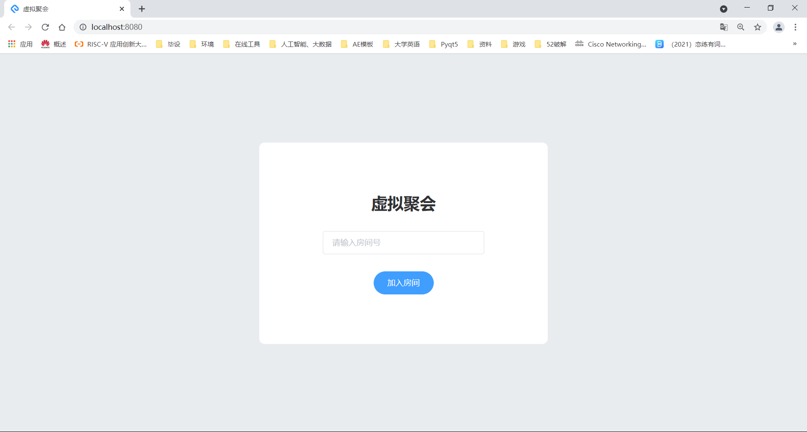
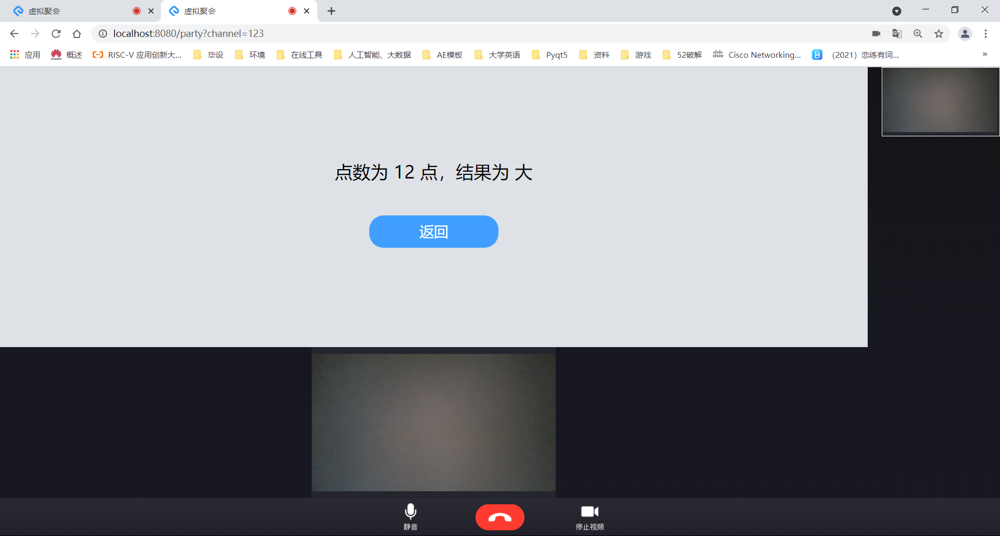

# 虚拟聚会

## 1.项目简介
随着生活节奏的加快，聚会、见面对人们来说变得越发的困难。
所以本项目准备开发一款支持虚拟聚会的软件。用户通过可以通过创建聚会生成聚会号或者使用聚会号加入到聚会中来。软件内部集成了聚会常用的娱乐程序。也可以一起听歌。

## 2.功能简介

- 输入聚会号加入聚会
- 实时视频语音通话
- 集成简单聚会小游戏

## 3.技术栈
Vue + 网易云信SDK

## 5.项目运行指南
安装必要依赖

```
npm install
```

启动服务

```
npm run serve
```

## 6.项目截图






