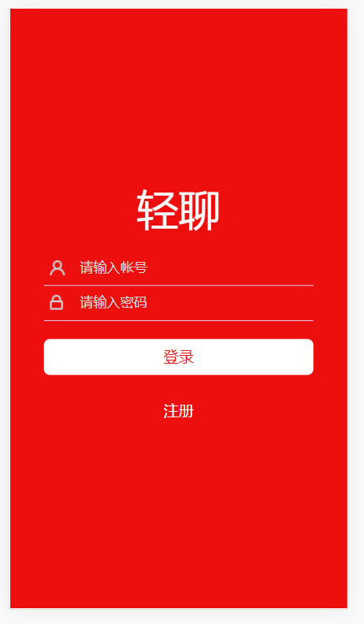
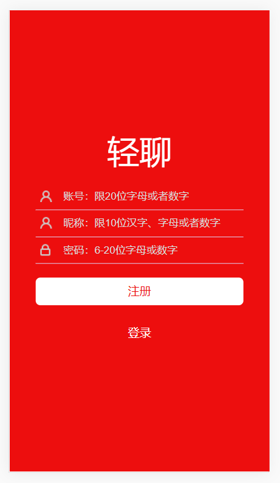
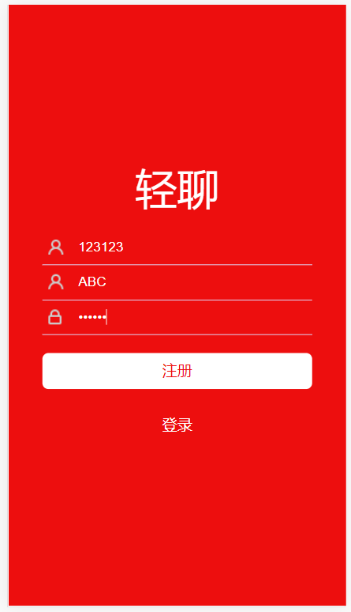
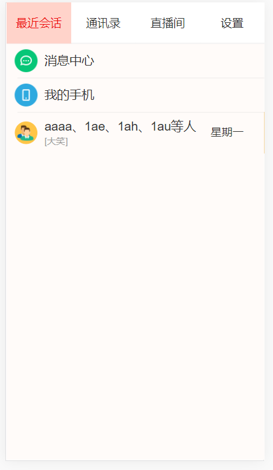

# 轻聊

## 1.项目介绍
一款基于不同情景的轻度H5聊天软件。在目前的社交软件中，有很多好友都只是针对某一个特定情境而添加的临时好友（当情景结束时便不再需要），因而面临着临时好友清理不便等诸多问题。本作品可针对特定应用场景建立分帐号，并可以随场景结束而删除。

## 2.项目运行指南
安装必要依赖

```
npm install
```

启动服务

```
npm run server
```

## 3.项目截图









