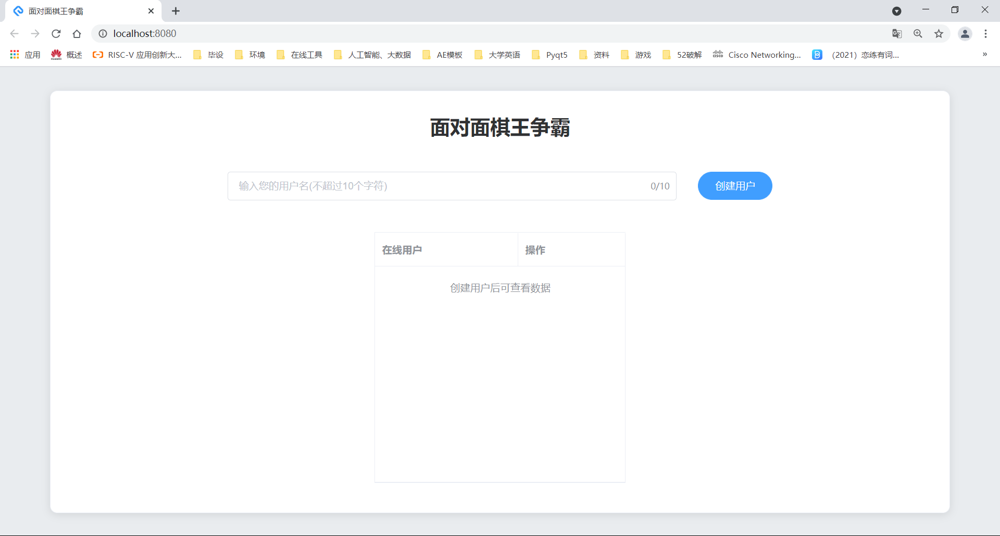
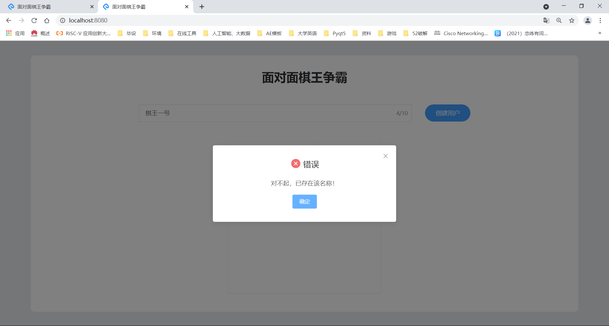
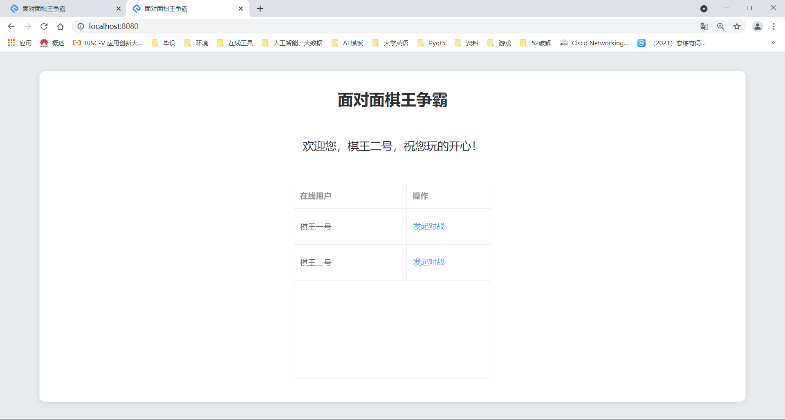
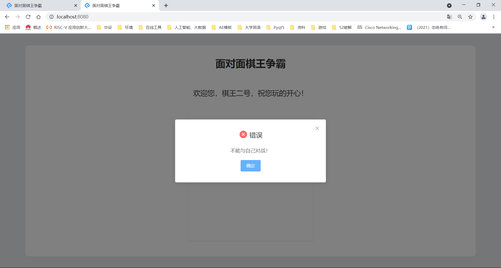
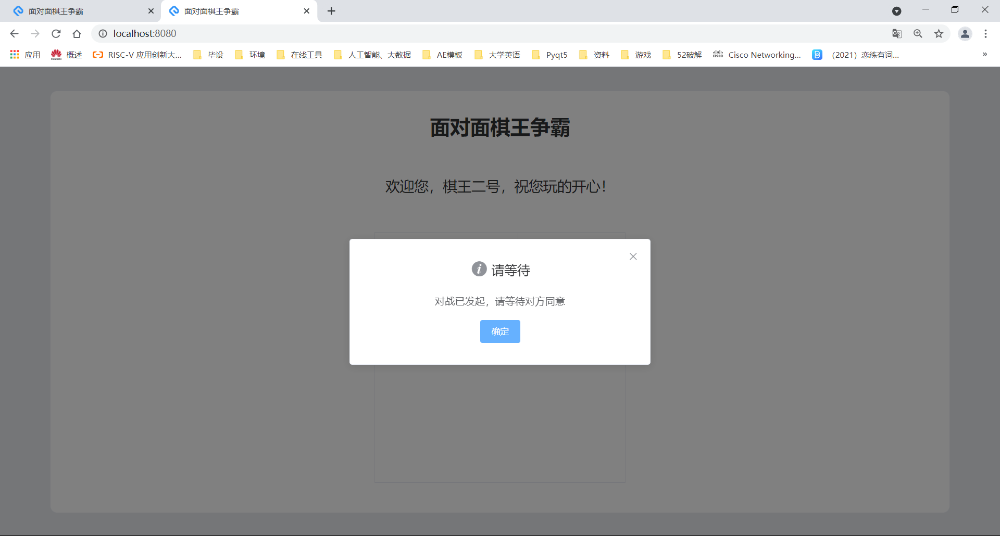
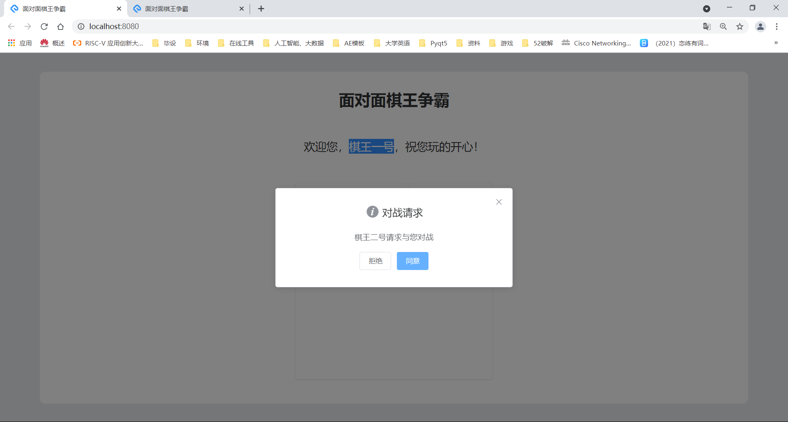
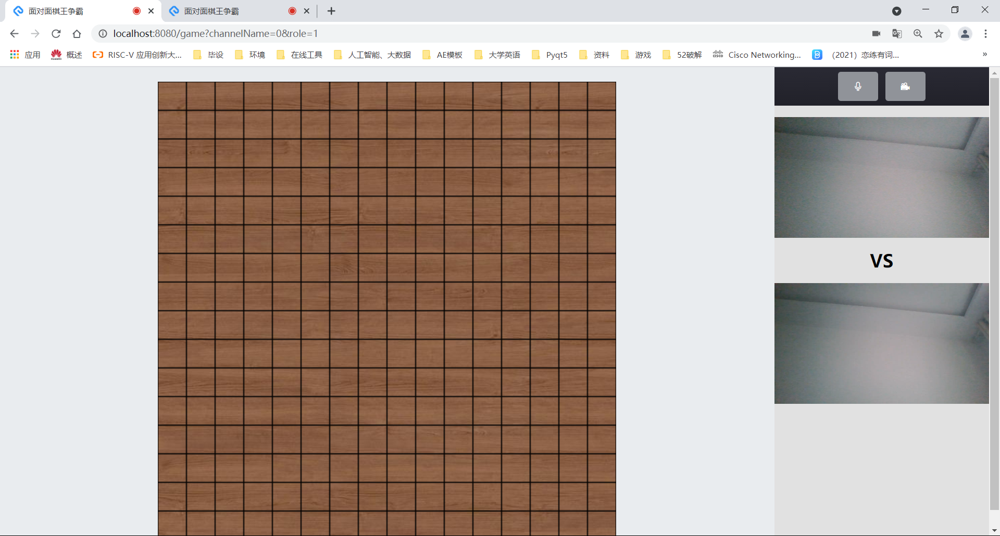
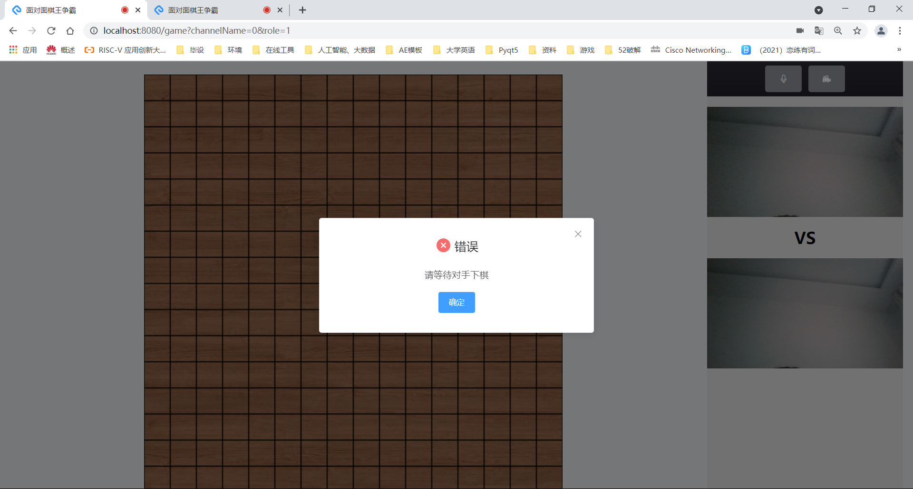
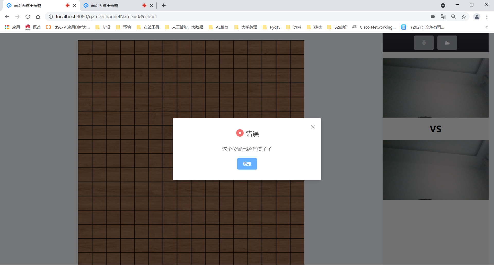

# 面对面棋王争霸

## 1.项目简介
一款可以实时匹配对战、实时视频通话的在线五子棋应用

## 2.功能简介

- 输入用户名创建用户，若用户名与已存在用户相同则会给出提示，引导重新填写用户名
- 查看在线用户列表，并可选择用户发起对战邀请
- 被挑战用户收到对战邀请，可选择接受或拒绝
- 接受挑战则进入实时对战、实时视频的对战页面
- 完善的五子棋游戏机制

## 3.技术栈
前端Vue 后端 Socket.io

网易云信SDK实现实时视频

## 5.项目运行指南
- 安装必要依赖

```
npm install
```

- 启动后端服务

```
node server.js
```

- 启动前端服务

```
npm run serve
```

- 正式环境打包

```
npm run build
```

- 代码检查及修复

```
npm run lint
```

## 6.项目截图



















